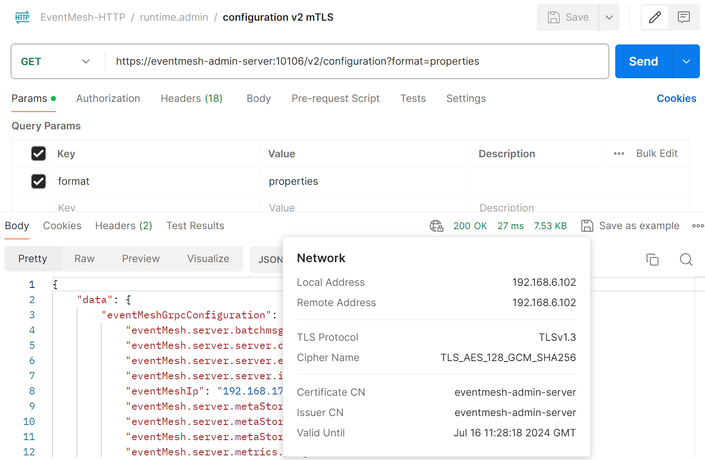
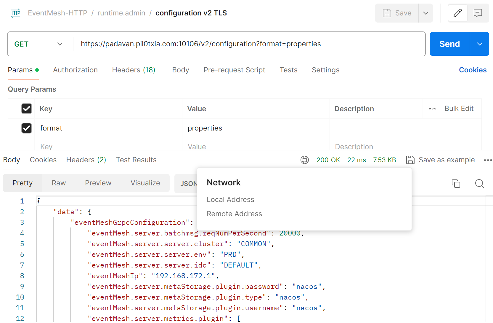

# HTTPS/(m)TLSv1.3

## 在 HTTP Admin Server 中启用 HTTPS

### 创建自签名证书 (mTLS)

EventMesh Runtime 目前支持加载`jks`格式的 SSL 证书文件。您可以在本地生成`jks`证书。

```shell
keytool -genkey -alias eventmesh-admin-server -keyalg RSA -keystore admin-server.jks
```

`-alias`参数的值即为您 EventMesh Runtime 节点的主机名或域名。您可以在路由/网关/DNS 服务器上设置主机名/域名与 IP 地址的映射关系。

大多数 Web 客户端默认不接收来自自签名证书服务器的流量。如果您信任此自签名证书及其所处的网络环境，可以允许客户端接收来自此自签名证书服务器的流量。

如果您不信任单向身份验证，您也可以使用双向 TLS (mTLS) 实现零信任安全。您需要在客户端侧配置此 SSL 证书的公钥部分，例如`pem`文件。`jks`证书可以使用`keytool`命令转换为`pem`文件。

配置完成后，效果如下：



### 导入权威证书 (TLS)

您可以将权威机构签发的`nginx`/`apache`格式的`pem`/`crt`/`key`证书转换为`jks`格式，并部署在 EventMesh Runtime 服务器上。

这种方式可以支持更多的 Web 客户端，例如浏览器，因为无需在 Web 客户端侧进行任何配置。

配置完成后，效果如下：



###  eventmesh-runtime 侧配置

配置 `eventmesh.properties` 中的以下条目：

```properties
eventMesh.server.admin.useTls.enabled=true # 默认值 false
eventMesh.server.admin.ssl.protocol=TLSv1.3 # 默认值 TLSv1.3，最低支持 TLSv1.1
eventMesh.server.admin.ssl.cer=admin-server.jks # 将文件置于启动脚本 start.sh 中指定的 confPath 目录，默认与 eventmesh.properties 同目录
eventMesh.server.admin.ssl.pass=eventmesh-admin-server
```

## 在 SDK 中启用 TLS

### eventmesh-runtime 侧配置

配置 `eventmesh.properties` 中的以下条目：

```properties
eventMesh.server.useTls.enabled=true # 默认值 false
eventMesh.server.ssl.protocol=TLSv1.1 # 默认值 TLSv1.1，最高支持 TLSv1.3
eventMesh.server.ssl.cer=sChat2.jks # 将文件置于启动脚本 start.sh 中指定的 confPath 目录，默认与 eventmesh.properties 同目录
eventMesh.server.ssl.pass=sNetty
```

您也可以通过环境变量来配置证书和密钥：

```properties
-Dssl.server.protocol=TLSv1.1
-Dssl.server.cer=sChat2.jks
-Dssl.server.pass=sNetty
```

### eventmesh-sdk-java 侧配置

```java
// 创建 producer
LiteClientConfig eventMeshHttpClientConfig = new eventMeshHttpClientConfig();
```

```java
// 设置开启 TLS
eventMeshHttpClientConfig.setUseTls(true);
LiteProducer producer = new LiteProducer(eventMeshHttpClientConfig);
```

配置环境变量：

```properties
-Dssl.client.protocol=TLSv1.1
-Dssl.client.cer=sChat2.jks
-Dssl.client.pass=sNetty
```
